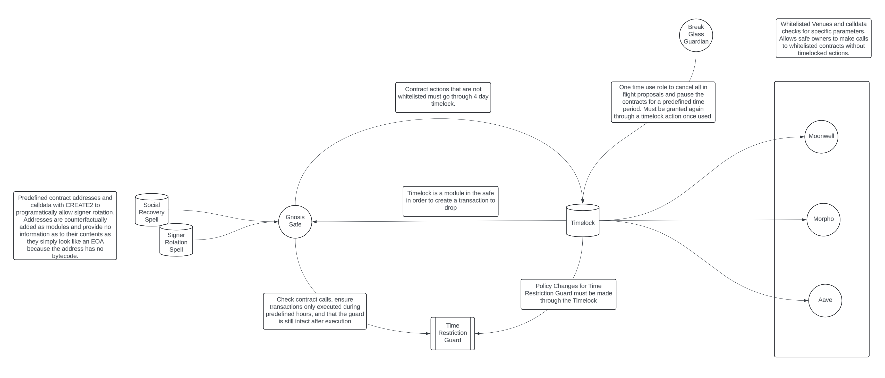

# Kleidi

The Kleidi Wallet is a collection of smart contracts that can be used to create a full self-custody wallet system for DeFi users. The protocol is opinionated and is designed to be used with Gnosis Safe multisigs, a timelock, guard contract, and recovery spells. It enables users to access DeFi yields and protocols, pull funds in case of emergency, and recover funds in case of lost keys either through social recovery or predefined backups.

## Design Principles

- **Security**: The protocol is designed by the world class Smart Contract engineering team at Solidity Labs. It has had components formally verified, and has been audited twice with no critical or high issues discovered. It is designed to be used with Gnosis Safe multisigs, which are battle-tested and have secured tens of billions of dollars in assets. See our internal audit log [here](docs/AUDIT_LOG.md).
- **Flexibility**: The protocol is designed to be flexible and can be used in a variety of ways. It can be used by DAOs, individuals, and other entities. Recovery spells allow users the ability to create custom recovery logic or flows to protect their assets.
- **Self Reliance**: This smart contract system is designed to enable a self custody system that does not require trusted third parties. Funds can be securely managed by a single user in this system setup. Users can recover their funds without needing to rely on a trusted third party, though they can choose to use a social recovery system if they wish.
- **Wrench Resistant**: One of the guiding principles of this system is to be resistant to $5 wrench attacks. Even if an attacker is able to coerce a user into signing a transaction, the system of recovery spells and guardians slows down an attacker trying to steal funds. With a 30 day timelock as the delay on new transactions, an attacker would need to kidnap a user for a month and remain undetected for the entire period in order to steal funds.
- **Defense in Depth**: The system is designed with multiple layers of security. The timelock prevents transactions from being executed immediately. Recovery spells can be used to create custom recovery logic for a multisig. The recovery spell could either completely rotate the multisig signer set, or contain more complex logic to recover funds in case of lost keys.

## Architecture


Each system component works together to ensure a user cannot be coerced into signing actions they do not want to take. 

- **[Guard](src/Guard.sol)**: This contract restricts the the multisig by disallowing delegate and self calls. This removes multicall functionality from the Gnosis Safe while enabled. Additionally, it stops owners from being rotated out of the multisig (except by modules), stops additional modules from being added or removed during a transaction, and prevents the guard from being disabled by a transaction. With these checks in place, it is impossible to remove the guard, rotate signers, or add new modules to the multisig without a timelocked transaction passing.
- **[Timelock](src/Timelock.sol)**: This contract holds all funds and requires a delay before a transaction can be executed. This delay can be set to any time period between 1 and 30 days. This delay prevents an attacker from immediately executing a transaction after coercing a user into signing a transaction. The timelock can whitelist contract calls and calldata, this allows hot signers to execute interactions with other smart contracts as long as the contract, function signature, and certain parts of the calldata are whitelisted.
- **[Recovery Spells](src/RecoverySpell.sol)**: Recovery spells are custom recovery mechanisms that can be used to recover funds in case of lost keys. They can be used to rotate the signers of a multisig, or to create other custom recovery logic. This allows users to craft custom recovery flows that can be used to recover funds in case of lost keys. Recovery spells can be used to create a recovery mechanism that is resistant to $5 wrench attacks, and can be used to recover funds in case of lost keys. A social recovery recovery spell could allow the recovery members to rotate the signers of the multisig after a predefined timelock. This would allow the multisig owner to cancel the recovery spell if they still had access to their keys, but would allow the recovery members to rotate the signers if the multisig owner lost their keys.

## Usage

The only safe way to create a new wallet is through the [InstanceDeployer](src/InstanceDeployer.sol) contract. Wallet contracts created outside of the InstanceDeployer should be assumed to be unsafe. The InstanceDeployer deploys a system instance atomically and deterministically with the desired configuration. The configuration will include the timelock delay, guardian, pause duration, whitelisted targets, calldatas, and the users' Gnosis Safe as the owner. The Instance Deployer contract will have no permission in the deployed contracts once the deployment transaction is completed.

Instance deployer will 

1. Deploy a timelock contract with the desired delay, guardian, pause duration, whitelisted targets, calldatas, with the users' Gnosis Safe as the owner.
2. Execute a transaction through the Gnosis Safe to perform the following actions:
   - initialize the timelock with the specified protocols and hot signers
   - add the Guard to the Safe
   - add the Timelock as a Safe module
   - add the recovery spells to the Safe as modules
   - remove the InstanceDeployer as an owner of the Safe
   - add the specified owners to the Safe
   - set the specified Safe threshold

## Edge Cases

- If the timelock is removed as a module from the Safe before the Guard is disabled, there will be no way to rotate the signers of the Safe, add new modules, or remove modules. 


### Build

```shell
forge build
```

### Test

```shell
forge test -vvv
```

### Testing

#### Unit Testing

```
forge test --mc UnitTest -vvv
```

#### Integration Testing

```
forge test --mc IntegrationTest -vvv --fork-url $ETH_RPC_URL --fork-block-number 20515328
```

### Coverage


#### Unit Test Coverage

```shell
forge coverage --mc UnitTest --report lcov
```

#### Unit & Integration Test Coverage

```shell
forge coverage --report summary --report lcov --fork-url $ETH_RPC_URL --fork-block-number 20515328
```